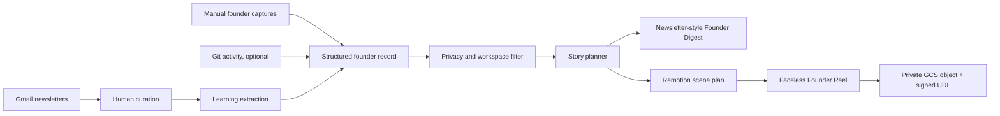

# Founder Build in Public

**Repository name:** `founder-build-in-public`  
**Product name:** Founder Build in Public  
**Hackathon:** BUIDL_OPC_Hackathon_SG 2026  
**Core promise:** Turn the work and learning a solo founder already does into a polished, newsletter-style Founder Digest and a faceless build-in-public video.

> Building in public should be an output of building—not another time-consuming job.

Builders are naturally focused on coding, learning, and shipping—not scripting, narrating, and editing content. Founder Build in Public turns founder-approved evidence from that existing work into two review-ready drafts: a **Founder Digest** and a **Founder Reel**.

## Two outputs from one founder story

- **Founder Digest:** a newsletter-style daily or weekly summary of what the founder learned, built, decided, and plans to do next.
- **Founder Reel:** a polished, faceless 45–60 second vertical video with narration and readable captions.

Both outputs are grounded in the same curated evidence and public-safe manifest. The founder reviews the drafts; the product never publishes automatically.

## Start here

Read these documents in order:

1. [`docs/PRD.md`](docs/PRD.md) — product definition and MVP acceptance criteria.
2. [`docs/ARCHITECTURE.md`](docs/ARCHITECTURE.md) — system design and data flow.
3. [`docs/IMPLEMENTATION_PLAN.md`](docs/IMPLEMENTATION_PLAN.md) — seven-hour build plan and cut lines.
4. [`AGENTS.md`](AGENTS.md) — instructions for Codex and other coding agents.
5. [`hermes-skill/founder-build-in-public/SKILL.md`](hermes-skill/founder-build-in-public/SKILL.md) — proposed Hermes skill.
6. [`docs/DEMO_PITCH.md`](docs/DEMO_PITCH.md) — live demo and self-generated submission video.
7. [`docs/HACKATHON_CHECKLIST.md`](docs/HACKATHON_CHECKLIST.md) — compliance and submission checklist.

## Product in one diagram



## MVP outputs

Every successful end-of-day run produces:

```text
outputs/<date>/
├── founder-digest.md
├── founder-digest.html
├── learning-log.json
├── public-manifest.json
├── story-plan.json
├── video-script.md
├── captions.srt
├── founder-reel.mp4
└── run-manifest.json
```

## Run the fixture golden path

Requires Node.js 20 or newer. Fixture mode uses synthetic data and does not require provider credentials.

```bash
npm install
npm run build
npm test
npm run demo
```

The demo writes private-by-default, gitignored artifacts to `outputs/2026-07-12/` and renders a 1080×1920, 56-second Founder Reel.

### Current implementation

Working now:

- strict TypeScript domain schemas and CLI;
- synthetic newsletter and founder-activity fixtures;
- workspace-aware privacy filtering and public-safe manifest compilation;
- deterministic fixture story planning;
- Markdown and HTML Founder Digest generation;
- caption and script generation;
- data-driven Remotion Founder Reel rendering with timed system narration;
- unit, schema, privacy, and fixture end-to-end tests.

Fixture mode uses the macOS system voice for local narration and falls back honestly to a caption-led render when it is unavailable. Live Gmail, OpenAI generation, GCS delivery, and optional Notion/Git integrations remain explicit follow-up milestones.

## Recommended command model

The core product should own a normal CLI:

```bash
founder <user> <workspace> <command>
```

Examples:

```bash
founder erick learning inbox
founder erick learning select --ids 1,3,4,7
founder erick hackathon capture "Built Gmail curation"
founder erick default end-day
```

Hermes should integrate through a **skill that calls the CLI**, rather than by modifying Hermes core.

Suggested Hermes usage:

```bash
hermes -s founder-build-in-public -q \
  "Run end-day for user erick in workspace default"
```

Or in an interactive Hermes session:

```text
/founder-build-in-public end-day --user erick --workspace default
```

The previously discussed syntax:

```bash
hermes founder erick default end-day
```

is a desirable future wrapper or plugin syntax, but should not be assumed to be a native Hermes subcommand for the MVP.

## Hackathon philosophy

The project should feel:

- simple enough to understand in one sentence;
- technically credible from the repository;
- visually polished in the generated output;
- agentic because it makes editorial decisions from evidence;
- privacy-aware because human judgment controls curation and publication;
- reliable enough to demo without live integrations.

The golden path matters more than feature count.
