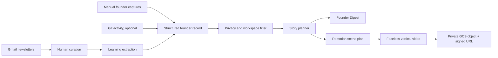

# Founder Build in Public — Project Starter Pack

**Repository name:** `founder-build-in-public`  
**Product name:** Founder Build in Public  
**Hackathon:** BUIDL_OPC_Hackathon_SG 2026  
**Core promise:** Turn the work and learning a solo founder already does into a curated founder digest and a polished, faceless build-in-public video.

> Building in public should be an output of building, not another job.

## Start here

Read these documents in order:

1. [`docs/PRD.md`](docs/PRD.md) — product definition and MVP acceptance criteria.
2. [`docs/ARCHITECTURE.md`](docs/ARCHITECTURE.md) — system design and data flow.
3. [`docs/IMPLEMENTATION_PLAN.md`](docs/IMPLEMENTATION_PLAN.md) — seven-hour build plan and cut lines.
4. [`AGENTS.md`](AGENTS.md) — instructions for Codex and other coding agents.
5. [`hermes-skill/founder-build-in-public/SKILL.md`](hermes-skill/founder-build-in-public/SKILL.md) — proposed Hermes skill.
6. [`docs/DEMO_PITCH.md`](docs/DEMO_PITCH.md) — live demo and self-generated submission video.
7. [`docs/HACKATHON_CHECKLIST.md`](docs/HACKATHON_CHECKLIST.md) — compliance and submission checklist.

## Product in one diagram



## MVP outputs

Every successful end-of-day run produces:

```text
outputs/<date>/
├── founder-digest.md
├── founder-digest.html
├── learning-log.json
├── public-manifest.json
├── story-plan.json
├── video-script.md
├── captions.srt
├── founder-reel.mp4
└── run-manifest.json
```

## Recommended command model

The core product should own a normal CLI:

```bash
founder <user> <workspace> <command>
```

Examples:

```bash
founder erick learning inbox
founder erick learning select --ids 1,3,4,7
founder erick hackathon capture "Built Gmail curation"
founder erick default end-day
```

Hermes should integrate through a **skill that calls the CLI**, rather than by modifying Hermes core.

Suggested Hermes usage:

```bash
hermes -s founder-build-in-public -q \
  "Run end-day for user erick in workspace default"
```

Or in an interactive Hermes session:

```text
/founder-build-in-public end-day --user erick --workspace default
```

The previously discussed syntax:

```bash
hermes founder erick default end-day
```

is a desirable future wrapper or plugin syntax, but should not be assumed to be a native Hermes subcommand for the MVP.

## Hackathon philosophy

The project should feel:

- simple enough to understand in one sentence;
- technically credible from the repository;
- visually polished in the generated output;
- agentic because it makes editorial decisions from evidence;
- privacy-aware because human judgment controls curation and publication;
- reliable enough to demo without live integrations.

The golden path matters more than feature count.
