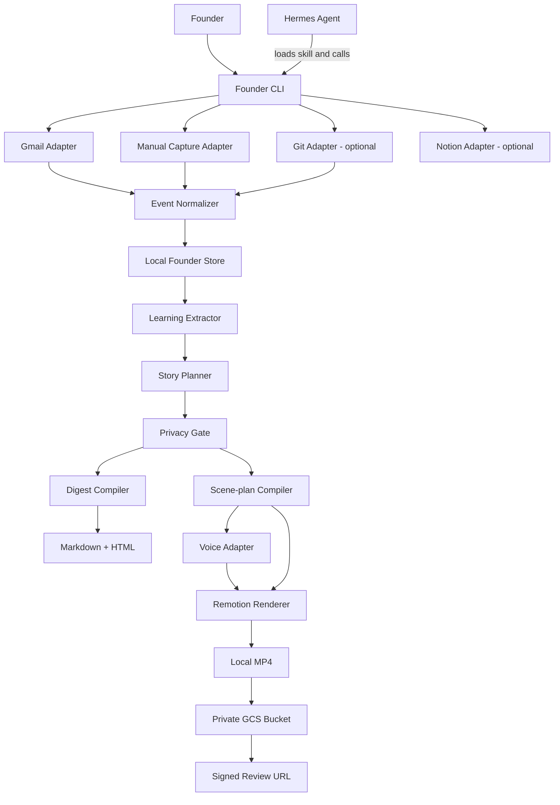
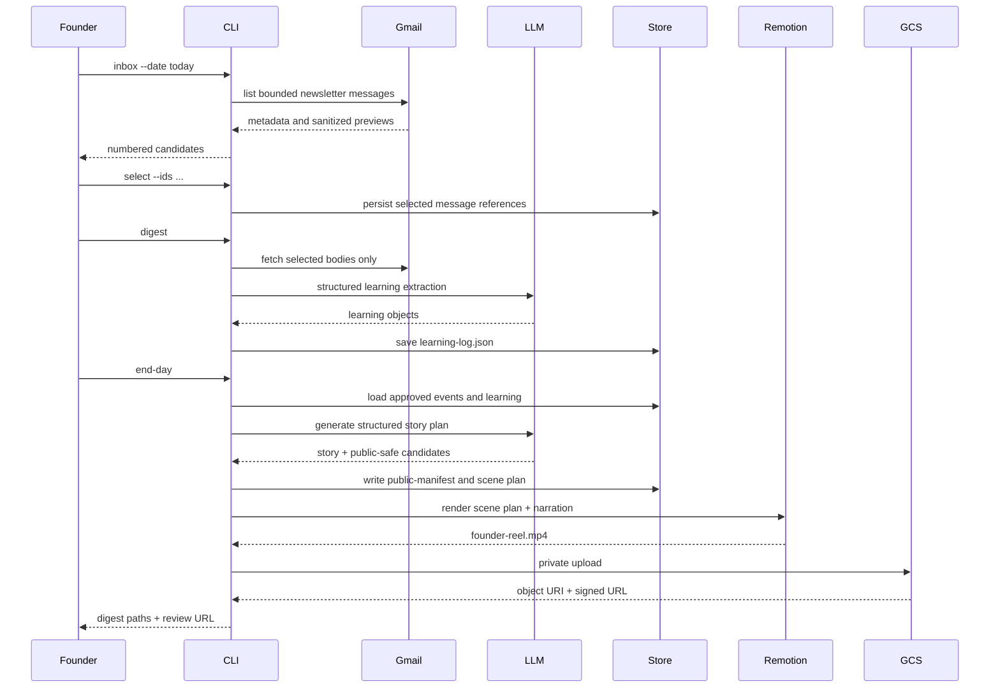
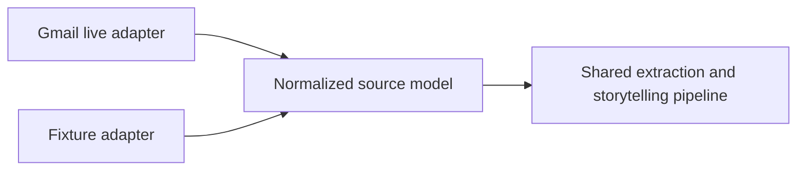

# Architecture

## 1. Architectural principles

1. **Local-first:** orchestration, temporary files, and canonical records live on the founder’s machine.
2. **Human-curated:** email retrieval may be automated, but only selected messages enter the reasoning pipeline.
3. **Workspace-aware:** employment, ventures, side projects, and personal activities are separated.
4. **Private by default:** public output is compiled only from an explicit public-safe manifest.
5. **Deterministic rendering:** the LLM creates structured editorial data; Remotion compiles it into video.
6. **Provider replaceability:** Gmail, Notion, LLM, voice, and storage are adapters around stable domain models.
7. **Demo resilience:** fixture mode follows the same internal pipeline as live mode.
8. **No dashboard:** the terminal is the product surface for the MVP.

## 2. Recommended stack

- **Runtime:** Node.js 20+ and TypeScript
- **CLI:** a lightweight TypeScript CLI library or direct argument parser
- **Agent runtime integration:** Hermes skill calling the core CLI
- **LLM:** OpenAI Responses API with structured output
- **Default runtime model:** configurable; start with `gpt-5.6-luna`
- **Video:** Remotion with React
- **Screenshot generation:** Playwright, if needed
- **Voice:** provider adapter; OpenAI speech or a system-voice fallback
- **Cloud storage:** Google Cloud Storage
- **Canonical storage:** local JSON files for the MVP
- **Optional second brain:** Notion API
- **Testing:** unit tests for pure domain functions; one fixture-based end-to-end test

A single TypeScript project is preferable to a multi-service architecture during a seven-hour hackathon.

## 3. System context



## 4. Component responsibilities

### 4.1 CLI layer

Responsibilities:

- parse user, workspace, command, date, and mode;
- load configuration;
- invoke one application use case;
- print concise progress and final artifact locations;
- return non-zero status on failure.

The CLI must not contain business logic.

### 4.2 Hermes skill

Hermes is the conversational and agentic shell. The skill:

- interprets natural-language founder requests;
- maps them to supported CLI commands;
- explains proposed destructive or external actions;
- invokes the CLI through the terminal tool;
- verifies output paths;
- does not own Gmail tokens, rendering code, or business state.

This follows a clean separation:

```text
Hermes skill = procedure and orchestration instructions
Core CLI = deterministic application logic and integrations
```

### 4.3 Connectors

Each connector produces normalized source records.

#### Gmail adapter

- authenticates with desktop OAuth;
- uses read-only scope;
- searches a date range, label, sender list, or query;
- retrieves only required message fields;
- strips tracking and unnecessary HTML;
- never writes to Gmail.

#### Manual capture adapter

- accepts text;
- associates it with user, workspace, date, and visibility;
- can add tags such as `learning`, `build`, `decision`, or `personal`.

#### Git adapter — optional

- reads local commit metadata and diff statistics;
- does not upload source code;
- converts commit evidence into public-safe summaries only after review.

#### Notion adapter — optional

- writes a daily learning page;
- is an export destination, not the canonical database;
- failure must not break the main pipeline.

### 4.4 Event normalizer

Converts all inputs into a common evidence model.

Example categories:

- source newsletter;
- personal activity;
- learning;
- build progress;
- decision;
- blocker;
- next action;
- planned event;
- completed event.

### 4.5 Local founder store

Recommended layout:

```text
~/.founder-build-in-public/
├── config.json
├── credentials/
├── users/
│   └── erick/
│       ├── workspaces.json
│       └── days/
│           └── 2026-07-12/
│               ├── raw/
│               ├── selected/
│               ├── learning-log.json
│               ├── events.json
│               └── outputs/
└── cache/
```

The public repository contains only sanitized fixtures.

### 4.6 Learning extractor

Input:

- curated newsletter content;
- user and workspace context.

Output:

- concise key points;
- `what_i_learned`;
- `why_it_matters`;
- suggested next actions;
- topic and project relationships;
- source traceability.

For cost control, selected messages should be cleaned and batched where practical. The final story planner should receive compact learning objects, not raw email bodies.

### 4.7 Story planner

The planner creates one editorial thesis, rather than listing every event.

Required decisions:

- central theme;
- hook;
- narrative arc;
- supporting evidence;
- what to omit;
- founder lesson;
- next step;
- scene sequence;
- estimated narration length.

Example thesis for the hackathon day:

> I turned an existing habit—reading every useful newsletter—into an agent that captures learning and converts it into build-in-public media.

### 4.8 Privacy gate

The privacy gate runs before every public artifact.

It must:

- deny confidential workspaces by default;
- remove email addresses, private names, URLs, IDs, and secrets;
- avoid quoting private newsletter text at length;
- mark unsupported claims;
- create a standalone `public-manifest.json`;
- require the video and public digest to read only from that manifest.

### 4.9 Digest compiler

Produces:

- private Markdown digest;
- public-safe Markdown digest;
- styled HTML digest;
- optional Notion export.

The compiler should be deterministic once structured content exists.

### 4.10 Remotion renderer

The renderer accepts only structured scene data and local approved assets.

Recommended templates:

- `HookScene`
- `MomentsScene`
- `TerminalScene`
- `NewsletterScene`
- `ProgressScene`
- `LessonScene`
- `RevealScene`

The video should avoid a dependency on prompt-to-video generation.

### 4.11 Storage adapter

The GCS adapter:

- uploads the finished MP4 and optional digest;
- writes into a private bucket or private prefix;
- returns object metadata;
- creates a short-lived signed read URL;
- never makes the bucket public.

Local storage remains a valid fallback.

## 5. Primary sequence



## 6. Live mode and fixture mode

Both modes must emit the same domain objects.



This prevents the demo path from becoming a hardcoded separate application.

## 7. Command integration reality

Hermes officially supports preloaded skills and slash-command skill invocation. Therefore, the most reliable MVP is:

```bash
hermes -s founder-build-in-public -q \
  "Run end-day for erick in default using fixture mode"
```

or:

```text
/founder-build-in-public end-day --user erick --workspace default --fixture
```

A native-looking positional command such as:

```bash
hermes founder erick default end-day
```

would require a Hermes plugin, wrapper, alias, or core CLI extension. It is a post-MVP enhancement, not a dependency for the golden path.

## 8. Deployment boundary

For the hackathon:

```text
Founder laptop
├── Hermes
├── Founder CLI
├── Gmail OAuth token
├── OpenAI API call
├── Remotion renderer
├── local artifacts
└── GCS upload
```

There is no hosted backend and no central user database.

## 9. Key architectural decision record

| Decision | Choice | Reason |
|---|---|---|
| Product surface | CLI | Fits technical solo founders and reduces scope |
| Agent integration | Hermes skill | Official extension mechanism; avoids forking |
| Core runtime | TypeScript | One language for CLI, integrations, and Remotion |
| Video engine | Remotion | Deterministic, inspectable, React-based templates |
| Canonical state | Local JSON | Fast, private, easy to demo |
| LLM model | Configurable, low-cost default | Controls runtime cost |
| Cloud storage | Existing GCS bucket | Familiar and low implementation risk |
| Publishing | Review only | Safer and aligned with human judgment |
| Notion | Optional export | Should not become a critical dependency |
